## F5 Distributed Cloud Service Discovery for BIG-IP Customer Edge (CE) Sites

## Table of Contents

- [F5 Distributed Cloud Service Discovery for BIG-IP Customer Edge (CE) Sites](#f5-distributed-cloud-service-discovery-for-big-ip-customer-edge-ce-sites)
- [Table of Contents](#table-of-contents)
- [Overview](#overview)
- [1. Prerequisites](#1-prerequisites)
- [2. BIG-IP Service Discovery](#2-big-ip-service-discovery)
  - [2.1. Configure BIG-IP for Service Discovery](#21-configure-big-ip-for-service-discovery)
  - [2.2. Create Load Balancer for the Virtual Server](#22-create-load-balancer-for-the-virtual-server)
  - [2.3. Enable High Availability for the Load Balancer](#23-enable-high-availability-for-the-load-balancer)
- [3. DMZ Deployment](#3-dmz-deployment)
- [4. Conclusion](#4-conclusion)

## Overview

This guide walks you through configuring and using BIG-IP Service Discovery for BIG-IP TMOS deployed on an F5 rSeries device.

BIG-IP Service Discovery automatically discovers app services in an existing BIG-IP configuration. It uses the F5 Distributed Cloud CE node to communicate with the BIG-IP deployment and discover Virtual Servers. This enables you to easily configure HTTP and HTTPS load balancing and expose your applications to the internet.

In the diagram below you can see the overview of the solution:

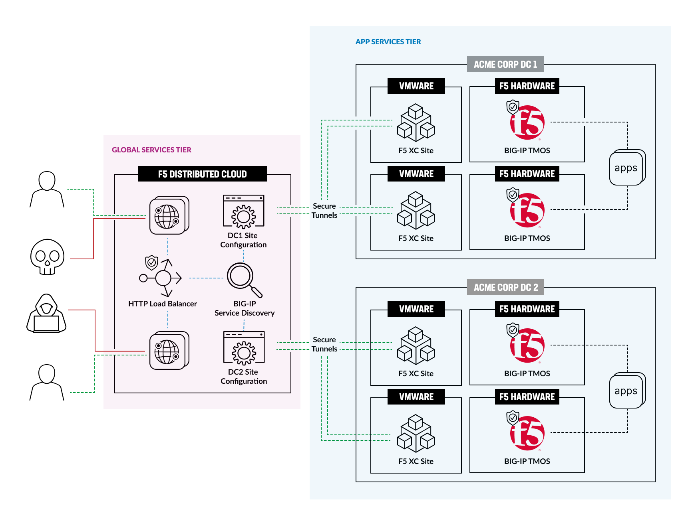

The setup includes the following:

- BIG-IP Service Discovery configuration to discover Virtual Servers.
- Application exposure to the internet using an HTTP Load Balancer.
- High Availability configuration with two BIG-IP instances.
- An optional second Data Center added and an HTTP Load Balancer configured for a complete DMZ deployment.

## 1. Prerequisites

This guide assumes that you have already completed [Extending App DMZ to Global Service Tier with F5 Hardware and Distributed Cloud Services](https://github.com/f5devcentral/f5-hybrid-security-architectures/tree/main/workflow-guides/app-dmz-rseries-xc).

To complete this guide, you will need the following:

- [F5 Distributed Cloud Account](https://cloud.f5.com/)
- F5 rSeries: 5600 / 5800 / 5900 / 10600 / 10800 / 10900 / 12600 / 12800 / 12900
- [BIG-IP installed on the rSeries device](https://github.com/f5devcentral/f5-hybrid-security-architectures/tree/main/workflow-guides/app-dmz-rseries-xc#13-deploy-and-configure-big-ip-on-f5-rseries)
- [XC Site installed on the VMware](https://github.com/f5devcentral/f5-hybrid-security-architectures/tree/main/workflow-guides/app-dmz-rseries-xc#21-deploy-ce-tenant-on-vmware)
- Virtual machine with an NGINX Docker container as a sample application
- [DNS Zone or domain name](https://docs.cloud.f5.com/docs-v2/dns-management/how-to/manage-dns-zones#create-primary-zone)

The diagram below shows the network configuration of the solution:

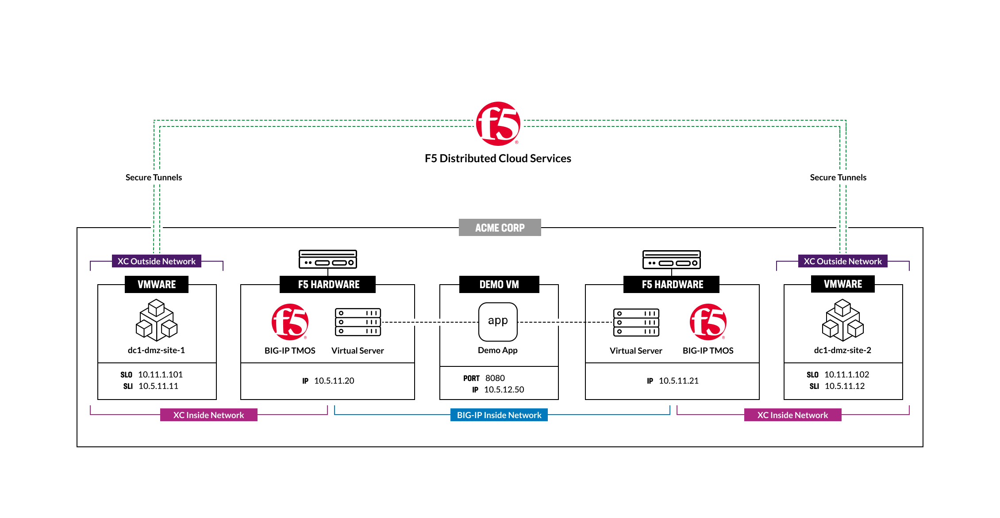

## 2. BIG-IP Service Discovery

The BIG-IP Service Discovery feature automatically detects app services and configures HTTP/HTTPS load balancing for internet exposure. Using the F5 XC Cloud CE node, it communicates with BIG-IP to discover Virtual Servers.

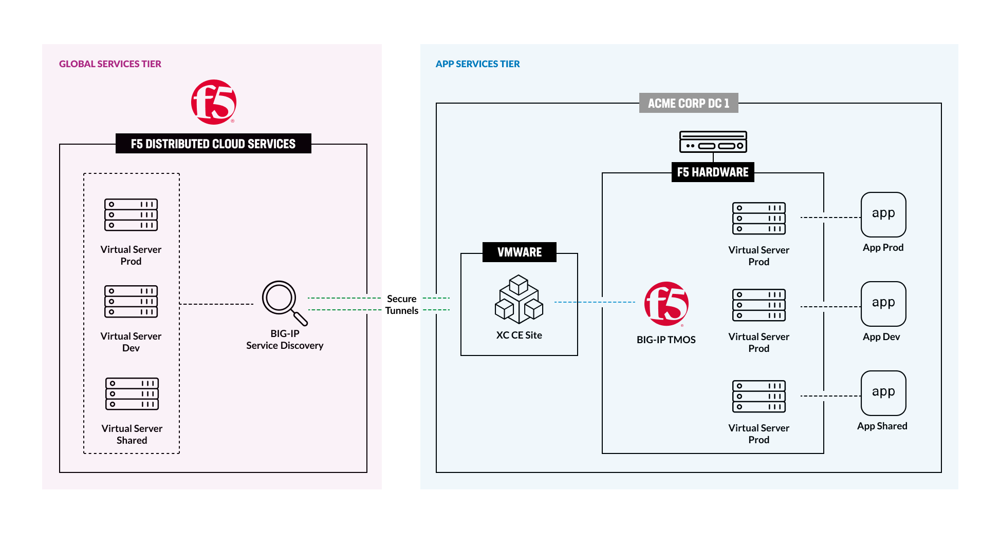

### 2.1. Configure BIG-IP for Service Discovery

Go to `Multi-Cloud App Connect`, click `Service Discoveries` in the left menu, then click `Add Service Discovery` to start the configuration.

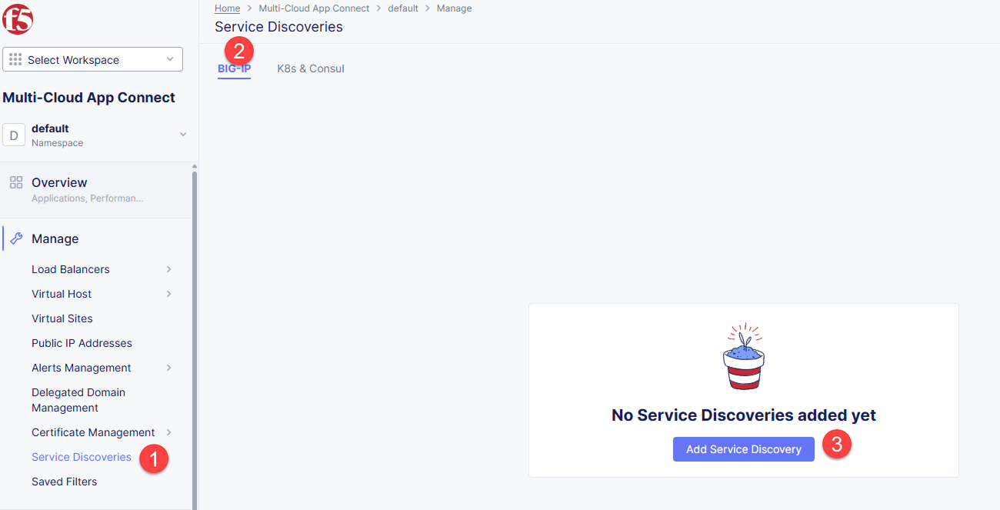

Enter a name for the Service Discovery. Optionally, add a description.

In the `Where` section, select the `Site` option for the `Virtual-Site or Site or Network` field. Then select your `VMware CE Site` from the list. Select `Site Local Inside Network` for the `Network` field.

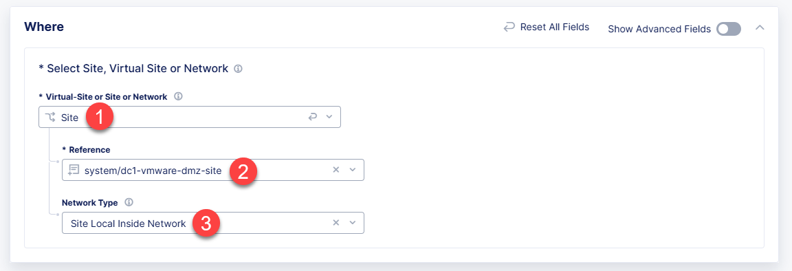

In the `Discovery Method` section, select `Classic BIG-IP Discovery Configuration`. Then click `Add Item`.

Enter a name for the BIG-IP configuration. Then click `Add Item` to add the BIG-IP details.

Enter the `BIG-IP Management IP` and `Username`. Then click `Configure` to add the `Admin Password`.

Enter the `Admin Password` in the `Secret to Blindfold` field. Then click `Apply`.

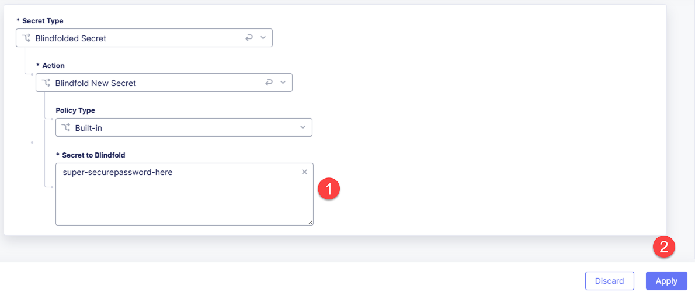

In `Virtual Server Filter`, you can filter Virtual Servers by `Name`, `Description`, and `Port Range`. For this example, we will filter by:

- Name: use the regex `^*app*` to filter Virtual Servers that have the word `app` in the name.
- Port Range: use `8080-8090` to filter Virtual Servers that use that port.

Then click `Apply`.

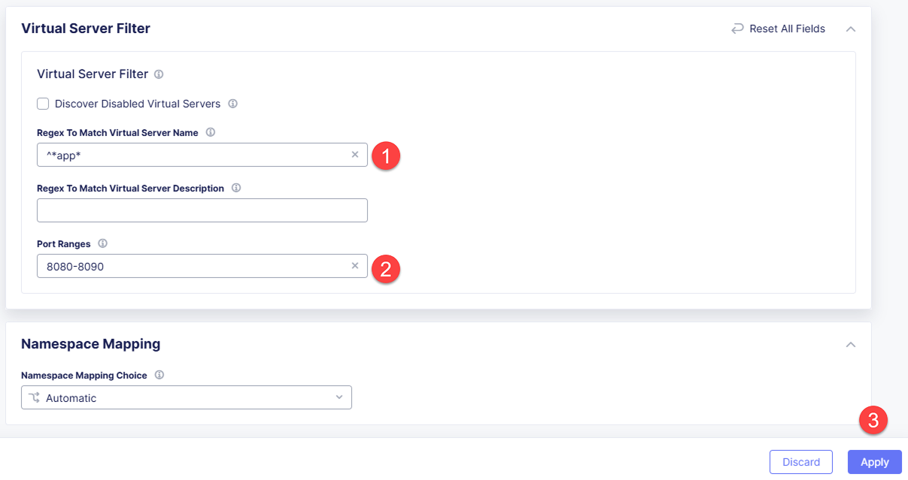

Click `Apply` to finish the configuration.

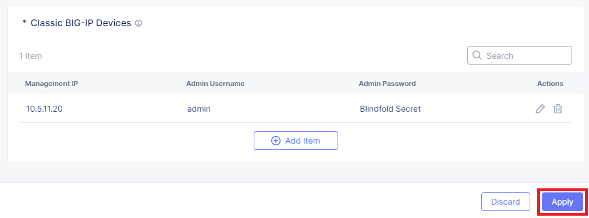

After the configuration is applied, you will see the discovered Virtual Servers. It may take a few minutes to load. Click the discovered services to see the details.

You can log in to BIG-IP to see the Virtual Servers that were discovered. Navigate to `Local Traffic` => `Virtual Servers` to view them.

### 2.2. Create Load Balancer for the Virtual Server

The HTTP Load Balancer exposes the application to the internet. The Load Balancer will be created for the Virtual Server discovered in the previous step.

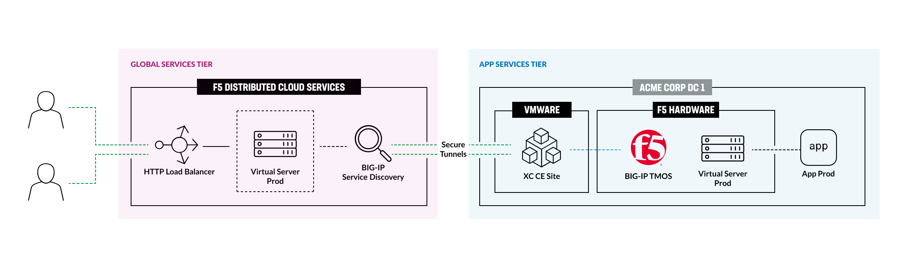

In our example, we discovered three Virtual Servers. Select `Add HTTP Load Balancer` from the Actions menu to create a Load Balancer for the Virtual Server.

In the modal, enter the details for the Load Balancer:

- `Name`: enter a name for the Load Balancer.
- `Domain`: enter the domain for the Load Balancer. In this example, we are using a delegated domain, which allows us to automatically create the DNS records for the Load Balancer.
- `LoadBalancer Type`: select the `HTTPS with Automatic Certificate` option.
- `Root CE Certificate of origin server`: select the certificate that will be used for the Load Balancer to communicate with the origin server.

Then click `Save and Exit`.

Navigate to `Load Balancers` => `HTTP Load Balancers` to see the Load Balancer that was created. It may take a few minutes to provision. The Load Balancer status will be `Valid` when it is ready to use.

Once the Load Balancer is ready, use the domain to access the application. Open the website in a browser to verify.

### 2.3. Enable High Availability for the Load Balancer

To enable High Availability for the Load Balancer, add a second BIG-IP instance to the Pool. The Load Balancer will automatically switch to the second BIG-IP instance if the first is down.

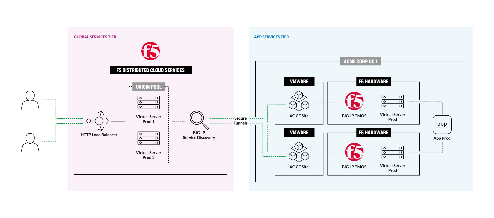

Repeat the steps in [2.1. Configure BIG-IP for Service Discovery](#21-configure-big-ip-for-service-discovery) to configure a second BIG-IP instance. Then open the `Origin Pool` assigned to the Load Balancer.

Click the `Edit Configuration` button to edit the Pool.

In the `Origin Servers` section, click the `Add Item` button to add the second BIG-IP instance to the Pool.

Select `cBIP Service Name of Origin Server` as the Type. Enter the `Service Name` of the second BIG-IP instance in the format `{service-discovery-name}-{bigip-name}-{app-name}`. Then click `Apply`.

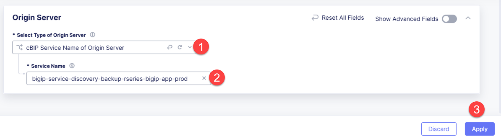

Enabling a Health Check for the Pool is recommended. Click the dropdown, then `Add Item` to add the Health Check.

Enter a name and leave the default values for the Health Check. Then click `Continue`.

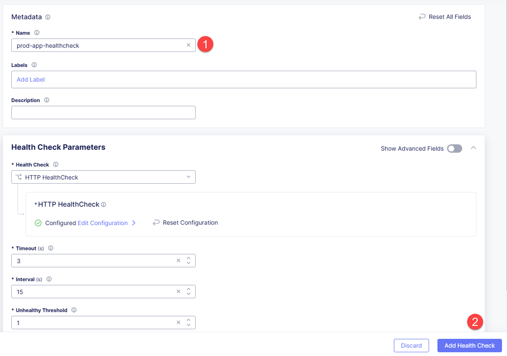

Click `Save and Exit` to save the Pool configuration.

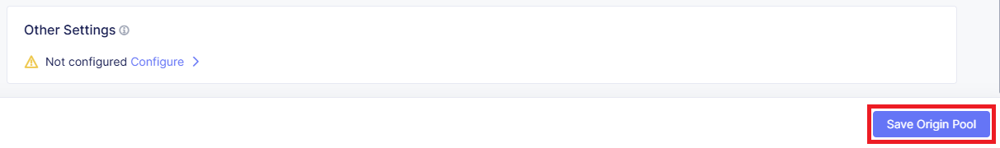

To test High Availability, stop the first BIG-IP instance. The Load Balancer will automatically switch to the second BIG-IP instance. Then open the website in a browser to verify the application is available.

## 3. DMZ Deployment

DMZ deployment is a common practice to improve application resiliency. In this section, you will add a second Data Center to the solution and configure the HTTP Load Balancer for a complete DMZ configuration.

Configure the second Data Center the same way as the first. Repeat the steps in [2.1. Configure BIG-IP for Service Discovery](#21-configure-big-ip-for-service-discovery) to configure the second BIG-IP instance. Then create the second `Origin Pool` as described in [2.3. Enable High Availability for the Load Balancer](#23-enable-high-availability-for-the-load-balancer).

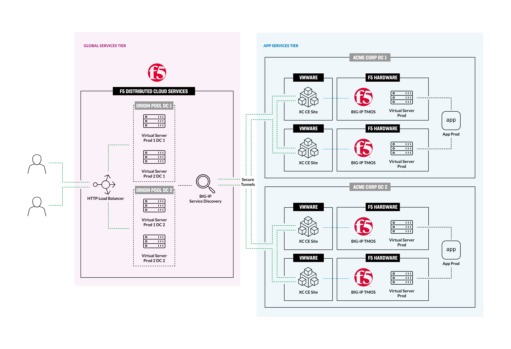

Add the second Data Center to the Load Balancer. Open the Load Balancer configuration.

Click the `Edit Configuration` button to edit the Load Balancer.

In the `Origin Pool` section, edit the existing Pool.

Change the `Priority` of the existing Pool to `1`. Then click `Apply` to save the changes.

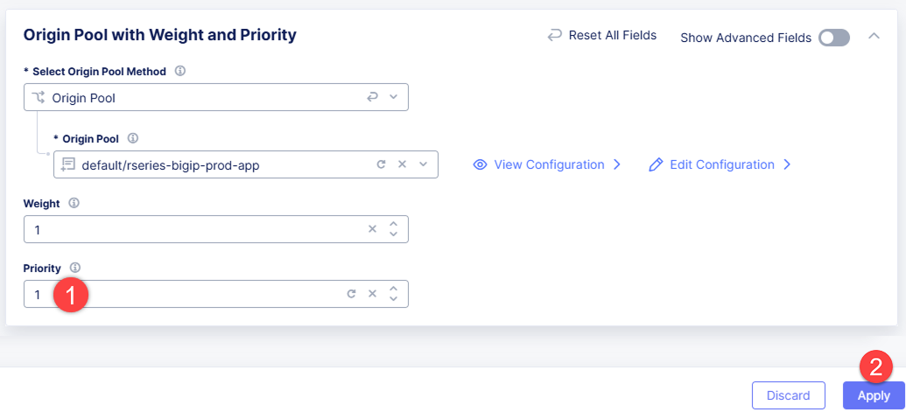

Click the `Add Item` button to add the second Pool to the Load Balancer.

Select the second Pool from the list. Change the `Priority` of the second Pool to `0`. Then click `Apply` to save the changes.

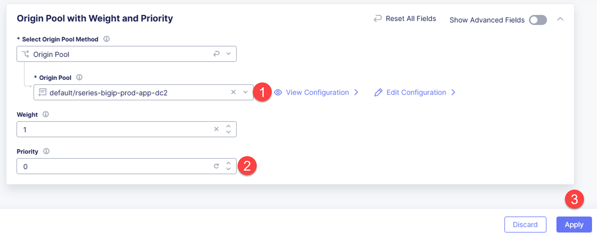

Review the configuration and ensure the `Priority` values are set correctly. Click `Save and Exit` to save the Load Balancer configuration.

To test the DMZ configuration, stop the first BIG-IP instance. The Load Balancer will automatically switch to the second BIG-IP instance. Then open the website in a browser to verify the application is available.

## 4. Conclusion

In this guide, you configured BIG-IP Service Discovery to discover the Virtual Servers and created an HTTP Load Balancer to expose the application to the internet. You also enabled High Availability for the Load Balancer and added a second Data Center to configure a DMZ deployment.
